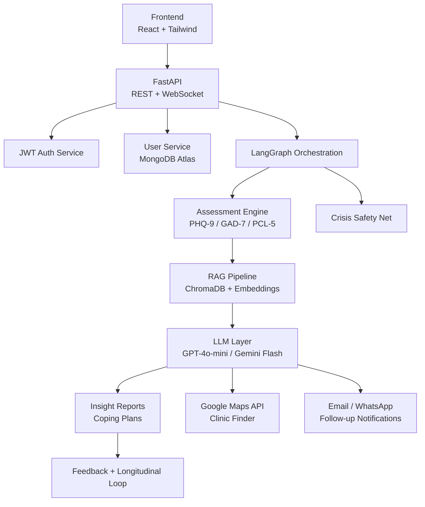

# MindBridge

AI-powered mental wellness companion focused on guided screening, supportive insights, coping guidance, and referral pathways. The product is designed as a structured wellness and assessment platform, not a clinical diagnosis system.

## Table of Contents

- [Project Overview](#project-overview)
- [Current Repository Status](#current-repository-status)
- [Vision and Target Platform](#vision-and-target-platform)
- [Core Capabilities](#core-capabilities)
- [Architecture Overview](#architecture-overview)
- [Technology Decisions](#technology-decisions)
- [Repository Structure](#repository-structure)
- [Getting Started](#getting-started)
- [Configuration](#configuration)
- [API Overview](#api-overview)
- [Delivery Workflow](#delivery-workflow)
- [Security, Privacy, and Safety](#security-privacy-and-safety)
- [Deployment Model](#deployment-model)
- [Known Gaps in the Current Snapshot](#known-gaps-in-the-current-snapshot)
- [License](#license)

## Project Overview

MindBridge is intended to help users move through a guided mental wellness journey:

1. Secure signup and authentication
2. Profile-based onboarding
3. Conversational screening with validated mental health screeners
4. Retrieval-augmented insight generation
5. Coping-plan generation
6. Crisis interception and helpline surfacing
7. Professional referral discovery
8. Longitudinal follow-up and feedback collection

The core product principle from the project specification is:

> Supportive first, clinical second.

### Important Disclaimer

MindBridge is planned as a mental wellness support and screening platform. It should not be represented as a replacement for licensed clinical diagnosis, emergency intervention, or medical treatment. Any production deployment should display this disclaimer clearly and provide region-appropriate crisis contacts.

## Current Repository Status

This repository snapshot currently contains the **backend service only** under [`server/`](server). The broader planning documents describe a larger platform with frontend, RAG, clinic discovery, notifications, and follow-up loops, but those modules are **not yet present in this code snapshot**.

### Implemented Today

- FastAPI backend with application lifespan hooks
- Async MongoDB connection using Motor
- Self-hosted JWT authentication
- User registration and login
- Access token refresh flow
- Authenticated profile lookup
- Logout by server-side refresh-token revocation
- PHQ-9 single-shot scoring and MongoDB persistence
- Paginated PHQ-9 assessment history
- LangGraph-based conversational PHQ-9 start/continue flow
- PHQ-9 item 9 crisis-support payloads with India-focused resources
- Swagger/ReDoc documentation endpoints

### Planned in the Product Specification

- Onboarding profile completion flows
- Additional conversational screeners: GAD-7, PCL-5, MDQ, and AUDIT
- ChromaDB-backed RAG pipeline
- Insight reports and coping plans
- Global crisis detection middleware for all conversational routes
- Google Maps clinic finder
- Feedback capture and day 7/day 30 follow-up loops
- React + Tailwind + shadcn/ui frontend

## Vision and Target Platform

The target product described in the provided planning documents is an end-to-end AI-assisted mental wellness platform with the following stages:

| Phase | Intended User Outcome |
|---|---|
| Signup and profile building | Establish identity, baseline context, and personalization inputs |
| AI assessment engine | Conduct structured conversational screening using validated screeners |
| RAG knowledge layer | Ground responses in DSM-5, NIMH, WHO, and curated self-help sources |
| Post-assessment output | Produce insight summaries, coping guidance, and next-step recommendations |
| Crisis safety net | Detect self-harm or suicidal ideation signals and interrupt normal flow |
| Follow-up loop | Re-engage users at day 7 and day 30 for progress tracking |

## Core Capabilities

### 1. Authentication and Identity

- Self-hosted JWT authentication using `python-jose`
- Password hashing with bcrypt via `passlib`
- Short-lived access tokens and longer-lived refresh tokens
- Server-side refresh token storage and revocation in MongoDB

### 2. User Profile and Personalization

The product specification expects profile-based personalization using:

- Age
- Gender
- Occupation
- Marital and lifestyle context
- Average sleep hours
- Social support level
- Significant recent life events

The current backend stores a starter `profile` object inside each user document and exposes authenticated `GET /api/profile` and `PUT /api/profile` routes.

### 3. Conversational Assessment

The backend currently implements PHQ-9 in two ways:

- `POST /api/assessment/phq9` accepts all nine answers, scores the assessment, saves it to MongoDB, and returns the computed result.
- `POST /api/assessment/phq9/start` and `POST /api/assessment/phq9/continue` run a LangGraph-backed one-question-at-a-time flow, return the final score after answer nine, and save the completed assessment.

Planned additional validated screeners include:

- `GAD-7` for anxiety
- `PCL-5` for PTSD screening
- `MDQ` for bipolar screening
- `AUDIT` for substance use

The current PHQ-9 graph maintains the collected answers, asks the next question, validates answer values `0` through `3`, and routes to scoring when nine answers have been collected.

### 4. Reports and Coping Guidance

Planned post-assessment outputs include:

- Plain-language insight report
- Personalized coping plan
- Referral suggestions to nearby professionals
- Longitudinal reassessment prompts

### 5. Crisis Safety

The project specification marks crisis interception as non-negotiable. Current PHQ-9 scoring flags clinical risk when question 9 has a score greater than `0` and returns a structured `crisis_support` object. The broader target behavior is:

- Inspect every inbound user message
- Detect self-harm or suicidal ideation signals using keyword and semantic matching
- Pause normal assessment/report generation
- Surface crisis support information immediately

The reference documents currently mention India-specific helplines:

- `iCall India`: `9152987821`
- `Vandrevala Foundation`: `1860-2662-345`

For any production release, these resources should be localized by deployment region and supplemented with emergency escalation guidance.

## Architecture Overview

### Target Architecture



### Current Request Flow

1. Client calls the FastAPI backend under `/api/*`
2. Protected routes use `OAuth2PasswordBearer` to extract the access token
3. Token is decoded using the configured JWT secret and algorithm
4. User identity is resolved from MongoDB
5. Auth and profile logic reads/writes user documents and refresh tokens
6. Assessment routes score PHQ-9 submissions, save completed single-shot assessments, and retrieve assessment history
7. Conversational PHQ-9 routes invoke the LangGraph assessment graph and return either the next question or the final scored result

## Technology Decisions

The planning documents define a clear stack direction. The table below distinguishes the strategic target stack from the code that exists today.

| Domain | Target Decision | Why It Was Chosen | Current Snapshot |
|---|---|---|---|
| Frontend | React + Tailwind + shadcn/ui | Fast SPA development and accessible components | Not present in repo |
| Backend | FastAPI + Uvicorn | Async-first, Pydantic-native, OpenAPI out of the box | Implemented |
| Auth | Self-hosted JWT + bcrypt | Full ownership of sensitive auth data | Implemented |
| Database | MongoDB Atlas | Natural fit for nested profiles, sessions, feedback | Implemented for users/auth/profile/assessments |
| Vector store | ChromaDB | Local/self-hosted and cost-efficient | Planned only |
| Embeddings | `nomic-embed-text` via Ollama | No API cost, local-friendly | Planned only |
| Orchestration | LangGraph | Stateful multi-turn workflows | Implemented for PHQ-9 conversation |
| LLM provider | GPT-4o-mini or Gemini Flash | Strong quality-to-cost ratio | Planned only |
| Maps | Google Maps Places API | Nearby clinic discovery | Planned only |
| Notifications | Email / WhatsApp APIs | Day 7/day 30 follow-up loop | Planned only |
| Hosting | Railway + Vercel | Simple MVP deployment model | Planned only |

## Repository Structure

### Actual Repository Layout

```text
MindBridge/
|-- server/
|   |-- src/
|   |   |-- api/routes/auth.py
|   |   |-- api/routes/profile.py
|   |   |-- api/routes/assessment.py
|   |   |-- core/config.py
|   |   |-- core/dependencies.py
|   |   |-- core/security.py
|   |   |-- db/mongodb.py
|   |   |-- graph/assessment_graph.py
|   |   |-- models/assessment.py
|   |   |-- models/user.py
|   |   |-- schemas/assessment.py
|   |   |-- schemas/user.py
|   |   |-- services/assessment_service.py
|   |   |-- services/user_service.py
|   |   `-- main.py
|   |-- API-DOCUMENTATION.md
|   |-- pyproject.toml
|   `-- uv.lock
|-- LICENSE
`-- README.md
```

### Target Solution Layout from Planning Documents

The provided `folder_structure.txt` describes a larger target solution with:

- `server/` for backend APIs and services
- `Client/` for the React frontend
- `docs/` for architecture and specification artifacts

That planned structure is useful as the implementation roadmap, but it is not fully committed in this repository snapshot.

## Getting Started

### Prerequisites

- Python `>= 3.14` as declared in [`server/pyproject.toml`](server/pyproject.toml)
- `uv` for dependency management
- MongoDB Atlas or a local MongoDB instance

### Local Development Setup

```bash
git clone <your-repository-url>
cd MindBridge/server
uv sync
uv run uvicorn src.main:app --reload
```

The backend should then be available at:

- API base: `http://localhost:8000/api`
- Swagger UI: `http://localhost:8000/docs`
- ReDoc: `http://localhost:8000/redoc`

### Windows PowerShell Alternative

```powershell
cd D:\MindBridge\Server
uv sync
uv run uvicorn src.main:app --reload
```

## Configuration

The backend reads configuration from `server/.env` through Pydantic settings.

### Required Environment Variables

| Variable | Required | Default | Purpose |
|---|---|---|---|
| `PREFIX` | Yes | None | Global API prefix, e.g. `/api` |
| `MONGODB_URL` | Yes | None | MongoDB connection string |
| `DATABASE_NAME` | Yes | None | MongoDB database name |
| `USER_COLLECTION` | Yes | None | MongoDB collection for user documents |
| `ASSESSMENT_COLLECTION_NAME` | Yes | None | MongoDB collection for assessment documents |
| `JWT_SECRET` | Yes | None | Secret used to sign JWTs |
| `JWT_ALGORITHM` | No | `HS256` | JWT signing algorithm |
| `ACCESS_TOKEN_EXPIRE_MINUTES` | No | `15` | Access token lifetime in minutes |
| `REFRESH_TOKEN_EXPIRE_DAYS` | No | `7` | Refresh token lifetime in days |

### Example `.env`

```dotenv
PREFIX=/api
MONGODB_URL=mongodb+srv://<username>:<password>@<cluster>/<database>?retryWrites=true&w=majority
DATABASE_NAME=mindbridge
USER_COLLECTION=patient
ASSESSMENT_COLLECTION_NAME=assessments
JWT_SECRET=<replace-with-a-long-random-secret>
JWT_ALGORITHM=HS256
ACCESS_TOKEN_EXPIRE_MINUTES=15
REFRESH_TOKEN_EXPIRE_DAYS=7
```

### Configuration Notes

- Do not commit real secrets or live database credentials
- The current code defaults the access token lifetime to `15` minutes
- Refresh token rotation is implemented; refresh reuse is validated against the stored token list

## API Overview

The backend currently exposes authentication, profile, and PHQ-9 assessment endpoints.

| Method | Path | Description |
|---|---|---|
| `POST` | `/api/auth/register` | Register a new user and issue access/refresh tokens |
| `POST` | `/api/auth/login` | Authenticate a user and issue a fresh token pair |
| `POST` | `/api/auth/login/swagger` | Form-based login endpoint for Swagger UI OAuth flow |
| `GET` | `/api/auth/me` | Return the authenticated user's email |
| `POST` | `/api/auth/refresh` | Issue a new access token from a valid refresh token |
| `POST` | `/api/auth/logout` | Clear stored refresh tokens and end active sessions |
| `GET` | `/api/profile` | Return the authenticated user's profile |
| `PUT` | `/api/profile` | Replace the authenticated user's profile |
| `POST` | `/api/assessment/phq9` | Score and save a complete PHQ-9 assessment |
| `GET` | `/api/assessment/phq9/history` | Return saved PHQ-9 assessment history |
| `POST` | `/api/assessment/phq9/start` | Start a conversational PHQ-9 flow |
| `POST` | `/api/assessment/phq9/continue` | Submit one conversational PHQ-9 answer |

### API Reference

Detailed request/response documentation lives in [`server/API-DOCUMENTATION.md`](server/API-DOCUMENTATION.md).

### Authentication Model

- Access tokens are passed in `Authorization: Bearer <token>`
- Refresh tokens are stored server-side in MongoDB
- Logout clears the stored refresh token array for the user
- Multiple sessions are possible because each login appends a refresh token
- The current logout implementation revokes all sessions for the user, not a single device session

### Assessment Model

- Single-shot PHQ-9 submissions are persisted to the configured assessment collection.
- Conversational PHQ-9 responses are stateful from the client's perspective: the frontend sends back the accumulated `answers` array on each `/continue` call.
- The conversational flow saves the completed PHQ-9 result to MongoDB after the ninth answer.
- PHQ-9 item 9 with any score greater than `0` sets `clinical_risk: true` and returns `crisis_support`.

## Delivery Workflow

The supplied workflow document defines the implementation sequence below.

| Workstream | Scope |
|---|---|
| `01 - JWT Auth` | Signup, login, refresh, `/me`-style endpoints |
| `02 - User Profiles` | MongoDB schemas and profile services |
| `03 - Assessment Engine` | LangGraph flow and PHQ-9 screener |
| `04 - RAG Pipeline` | ChromaDB setup and document ingestion |
| `05 - Crisis Safety Net` | Detection middleware and helpline response |
| `06 - Report Generator` | Insight report and coping-plan output |
| `07 - Frontend Auth` | Login/signup UI and token handling |
| `08 - Frontend Chat UI` | Streaming chat interface |
| `09 - Clinic Finder` | Google Maps integration |
| `10 - Testing` | Backend and frontend test coverage |

### Suggested MVP Timeline from the Specification

| Time Window | Focus |
|---|---|
| Week 1-2 | JWT auth, signup/login/refresh, profile form |
| Week 3 | PHQ-9 conversational assessment |
| Week 4 | Basic insight report and static clinic directory |
| Week 5 | Crisis banner and helpline surfacing |
| Week 6 | Google Maps clinic finder and feedback |
| Week 7-8 | RAG pipeline and additional screeners |

## Security, Privacy, and Safety

### Security Principles

- Passwords must always be stored as bcrypt hashes
- JWT secrets must be environment-managed and rotated when exposed
- Protected routes must validate tokens before business logic executes
- Refresh tokens must remain revocable server-side
- Sensitive health-related data should be encrypted at rest in production

### Privacy Principles from the Project Specification

- Users should have a one-click data deletion path
- Raw LLM outputs should not be logged if they contain sensitive user content
- The platform should maintain clear disclosure that it is not a diagnostic system
- Any production release handling health-related data should undergo legal and compliance review for its jurisdiction

### Safety Principles

- Crisis detection is mandatory in every conversational route
- Assessment flow must pause on self-harm risk indicators
- Helpline and escalation guidance must be visible immediately
- Crisis resources should be localized by geography

## Deployment Model

The target deployment topology described in the project documents is:

- Frontend on `Vercel`
- Backend on `Railway`
- Data in `MongoDB Atlas`
- Vector storage in `ChromaDB`
- Optional Ollama/local embedding runtime for development

### Minimum Production Readiness Checklist

- Separate development, staging, and production environments
- Managed secret storage instead of plaintext `.env` sharing
- Structured logging and request tracing
- Rate limiting on auth and chat endpoints
- Audit logging for sensitive account actions
- Monitoring and alerting for auth failures and crisis-trigger events
- Backup and recovery procedures for MongoDB data

## Known Gaps in the Current Snapshot

The README intentionally separates implemented behavior from planned behavior. At the time of writing, the main gaps are:

- No frontend application is committed in this repository snapshot
- ChromaDB, embedding, and LLM integration code is not present
- LangGraph is present only for the PHQ-9 conversational flow
- No clinic finder, notification, feedback, or follow-up modules are present
- Only focused backend unit tests are present; broader integration and frontend tests are still missing
- Chat-route/global crisis interception middleware is still missing; PHQ-9 item 9 now returns structured crisis support

## License

This repository includes an MIT license. See [`LICENSE`](LICENSE).
